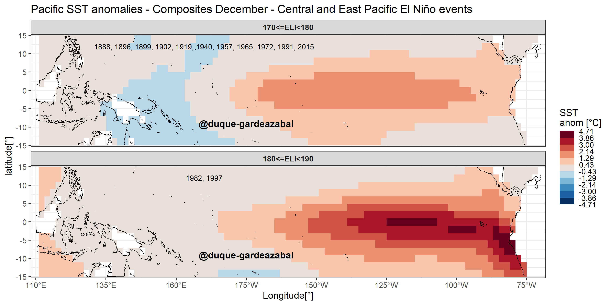
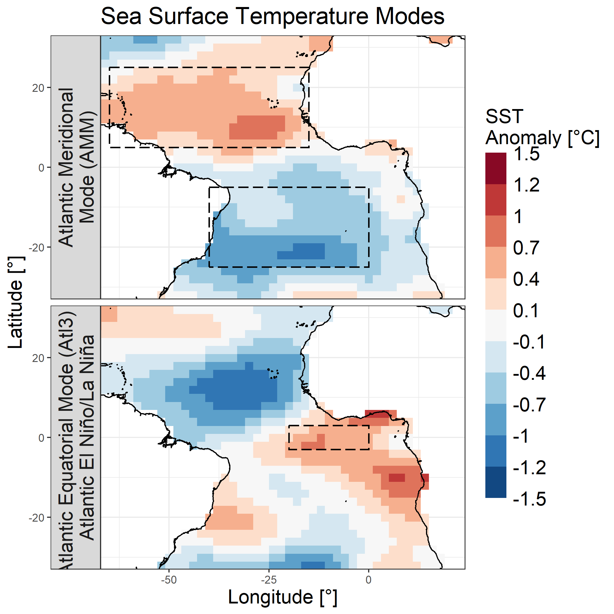
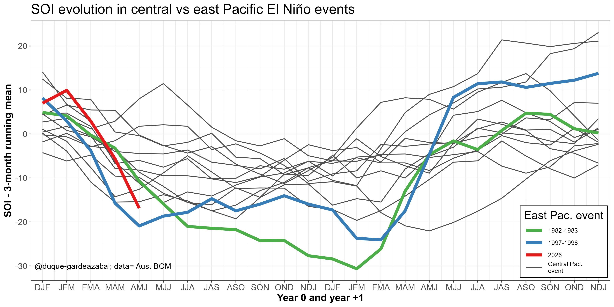
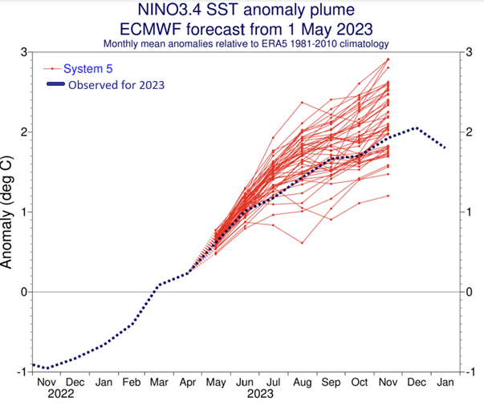

## Hi, what brought you here?? 

:::{margin} 

:::

Welcome to this *anxious* attempt to help create a better world through analysing climate variability impacts on socio-economic sectors. Specifically, I research and work on drivers of weather and climate impacts on **renewable energy sources** (wind, solar and hydro-power) and to the analysis of **extreme hydrometeorological events** (droughts, floods, and - someday - heat, fires, and wind extremes), that have impacts on agriculture and the broad economy. 

This helps to improve forecasts, adjust logistic processes and *reduce the impacts on businesses* (climate services).

**Current El Niño Longitude Index (ELI) = 179.2 - Date: 2026-06-22 - [ENSO diversity](pages/part01/ENSO_diversity.md)**

---

<!-- :::{card} ENSO diversity
:link: pages/part01/ENSO_diversity.md

+++
**Current El Niño Longitude Index (ELI) = 179.2 - Date: 2026-06-22** 
::: -->

## Featured Projects

::::{grid} 1 2 4 4

:::{card}
:link: pages/part01/Atl_impacts.md

+++
**Atlantic variability**
:::

:::{card}
:link: pages/part01/ENSO_diversity.md

+++
**ENSO diversity**
:::

:::{card}
:link: pages/part02/Climate_services.md

+++
**Climate Services**
:::
<!-- 
:::{card}
:link: https://python.org

+++
**Python**
::: -->

::::

---
